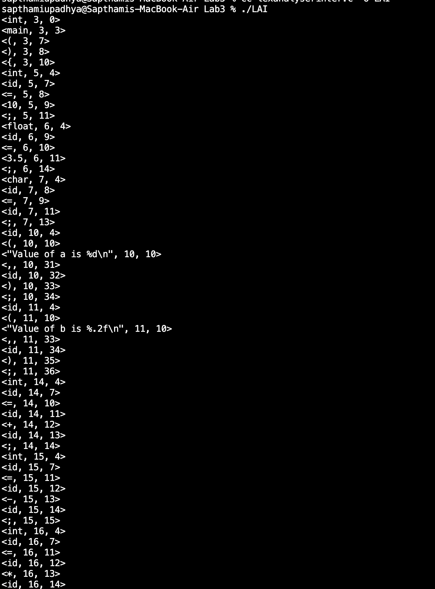
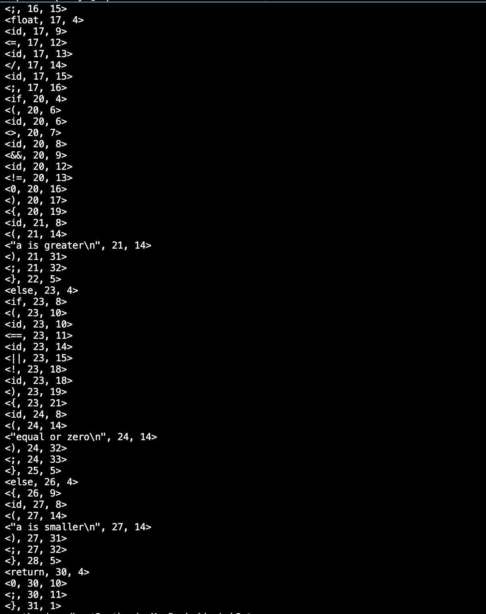
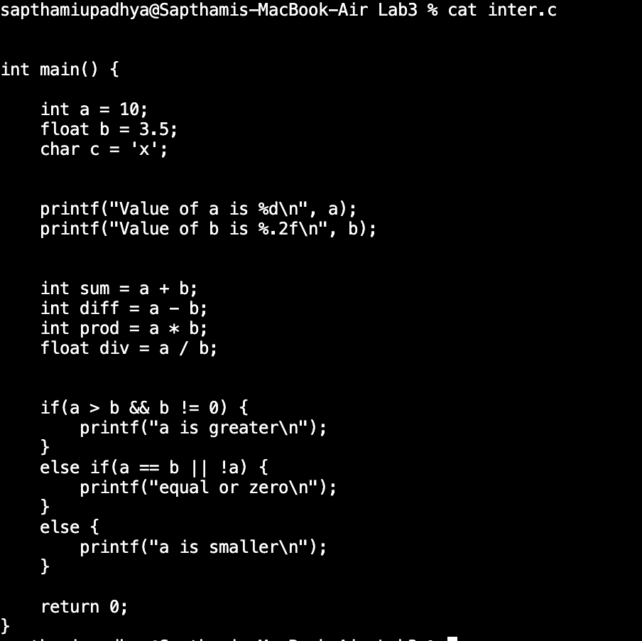

**Name:** Sapthami Upadhya  
**Section:** CSE A  
**Roll No.:** 15  
**Reg. No.:** 230905090  

**Week 3**

2. Design a lexical analyzer that includes a getNextToken() function for processing a simple C program. The analyzer should construct a token structure containing the row number, column number, and token type for each identified token. The getNextToken() function must ignore tokens located within singleline or multi-line comments, as well as those found inside string literals. Additionally, it should strip out preprocessor directives.

Code:
```c
#include<stdio.h>
#include<stdlib.h>
#include<string.h>
#include<ctype.h>
typedef struct{
    char type[1000];
    int row, col;
}TOKEN;
char* keywords[] = {"int", "float", "char", "void", "if", "else", "while", "for", "return", "main"};
int keycount = 10;
int row, col;
FILE* fp;
int isKeyword(char* str){
    for(int i = 0; i < keycount; i++)
        if(strcmp(str, keywords[i]) == 0) return 1;
    return 0;
}
TOKEN readString(){
    TOKEN token;
    int startrow = row;
    int startcol = col;
    int i = 0;
    char buf[256];
    char c = getc(fp);
    col++;
    buf[i++] = c;
    while((c = fgetc(fp)) != EOF){
        col++;
        buf[i++] = c;
        if(c == '"') break;
        if(c == '\n'){
            row++;
            col = 0;
        }
    }
    buf[i] = '\0';
    token.row = startrow;
    token.col = startcol;
    strcpy(token.type, buf);
    return token;
}
TOKEN readId(){
    TOKEN token;
    int startrow = row;
    int startcol = col;
    char buf[100];
    int i = 0;
    char c = getc(fp);
    col++;
    buf[i++] = c;
    while(1){
        char next = getc(fp);
        if(isalnum(next) || next == '_'){
            col++;
            buf[i++] = next;
        }
        else{
            fseek(fp, -1, SEEK_CUR);
            col--;
            break;
        }
    }
    buf[i] = '\0';
    token.row = startrow;
    token.col = startcol;
    if(isKeyword(buf)) strcpy(token.type, buf);
    else strcpy(token.type, "id");
    return token;
}
TOKEN readNum(){
    TOKEN token;
    int startrow = row;
    int startcol = col;
    char buf[100];
    int i = 0;
    int decimal = 0;
    char c = getc(fp);
    col++;
    buf[i++] = c;
    while(1){
        char next = getc(fp);
        if(isdigit(next)){
            col++;
            buf[i++] = next;
        }
        else if(next == '.' && !decimal){
            col++;
            decimal = 1;
            buf[i++] = next;
        }
        else{
            fseek(fp, -1, SEEK_CUR);
            col--;
            break;
        }
    }
    buf[i] = '\0';
    token.row = startrow;
    token.col = startcol;
    strcpy(token.type, buf);
    return token;
}
TOKEN readOp(){
    TOKEN token;
    int startrow = row;
    int startcol = col;
    char buf[10];
    int i = 0;
    char c = getc(fp);
    col++;
    buf[i++] = c;
    char next = getc(fp);
    if((c=='=' && next=='=') || (c=='<' && next=='=') || (c=='>' && next=='=') || (c=='!' && next=='=') || (c=='&' && next=='&') || (c=='|' && next=='|')){
        col++;
        buf[i++] = next;
    }
    else {
        fseek(fp, -1, SEEK_CUR);
        col--;
    }
    buf[i] = '\0';
    token.row = startrow;
    token.col = startcol;
    strcpy(token.type, buf);
    return token;
}
TOKEN readSymbol(){
    TOKEN token;
    char c = getc(fp);
    col++;
    token.row = row;
    token.col = col;
    token.type[0] = c;
    token.type[1] = '\0';
    return token;
}
TOKEN getNextToken(){
    TOKEN token;
    char c;
    c = getc(fp);
    if(c=='\n'){
        row++;
        col = 0;
        return getNextToken();
    }
    if(c == ' ' && c == '\t'){
        col++;
        return getNextToken();
    }
    if(c == EOF){
        strcpy(token.type, "EOF");
        return token;
    }
    fseek(fp, -1, SEEK_CUR);
    if(c == '"') return readString();
    if(isalpha(c) || c == '_') return readId();
    if(isdigit(c)) return readNum();
    if(c=='+' || c=='-' || c=='*' || c=='/' || c=='<' 
    || c=='>' || c=='=' || c=='!' || c=='&' || c=='|') return readOp();
    if(c==';' || c==',' || c=='(' || c==')' 
    || c=='{' || c=='}' || c=='[' || c==']') return readSymbol();
    getc(fp);
    col++;
    return getNextToken();
}
void preprocess(FILE* src, FILE* dest){
    char c, next;
    while((c=getc(src)) != EOF){
        //preprocessor directive
        if(c == '#'){
            while( c != '\n' && c != EOF)
                c = getc(src);
            putc('\n', dest);
            continue;
        }
        //comment
        if(c == '/'){
            next = getc(src);
            if(next == '/'){
                while(c != '\n' && c != EOF)
                    c = getc(src);
                putc('\n', dest);
                continue;
            }
            else if(next == '*'){
                while(1){
                    c = getc(src);
                    if(c == '*'){
                        char end = getc(src);
                        if(end == '/') break;
                    }
                }
                continue;
            }
            else{
                putc(c, dest);
                putc(next, dest);
                continue;
            }
        }
        putc(c, dest);
    }
}
int main(){
    FILE* src, *inter;
    src = fopen("samplela.c", "r");
    if(!src){
        printf("Cannot open source file\n");
        return 0;
    }
    inter = fopen("inter.c", "w");
    preprocess(src, inter);
    fclose(src);
    fclose(inter);

    fp = fopen("inter.c", "r");
    if(!fp){
        printf("Cannot open intermediate file\n");
        return 0;
    }
    TOKEN token;
    row = 1;
    col = 0;
    do{
        token = getNextToken();
        if(strcmp(token.type, "EOF") != 0)
            printf("<%s, %d, %d>\n", token.type, token.row, token.col);
    } while(strcmp(token.type, "EOF") != 0);
    fclose(fp);
    return 0;
}
```

Input/Output:  

|  |  |
| --------------- | --------------- |
|  |  |
|                 |                 |
