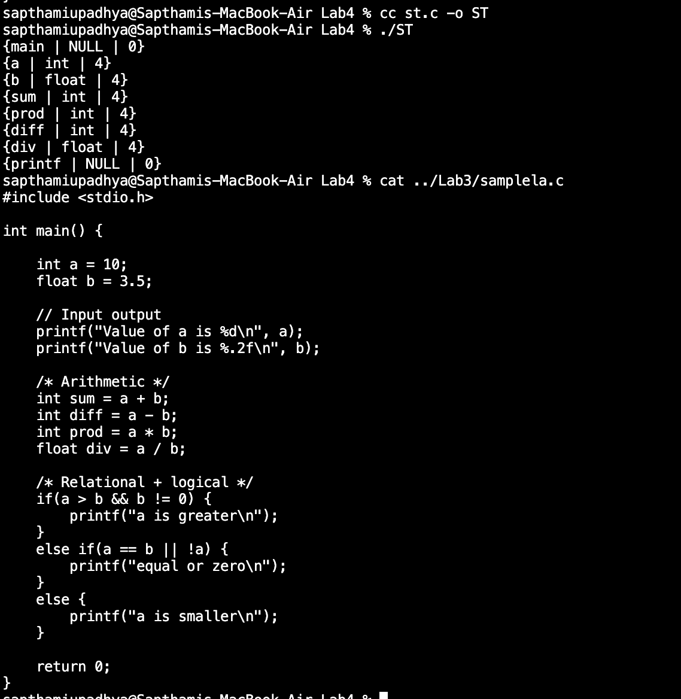
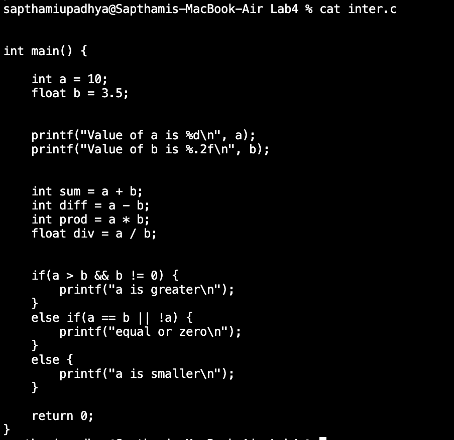

**Name:** Sapthami Upadhya  
**Section:** CSE A  
**Roll No.:** 15  
**Reg. No.:** 230905090

**Week 4**

1. Using getNextToken() implemented in Lab No 3, design a Lexical Analyser to implement the local symbol table.

- Code:
```c
#include<stdio.h>
#include<stdlib.h>
#include<string.h>
#include<ctype.h>

#define length 30
char* keywords[] = {"if", "else", "while", "for", "return", "case", "do", "break", "continue", "switch"};
int keycount = 10;
char* datatypes[] = {"int", "float", "char", "void", "bool", "double", "long"};
int typecount = 7;

typedef struct{
	char lexeme[20];
	int size;
	char type[10];
}SYMBOL;
typedef struct node{
	SYMBOL symbol;
	struct node* next;
}NODE;

NODE* table[length];

char type[10];
FILE* fp;

int isKeyword(char* str){
    for(int i = 0; i < keycount; i++)
    	if(strcmp(str, keywords[i]) == 0) return 1;
    return 0;
}

int isDatatype(char* str){
    for(int i = 0; i < typecount; i++)
    	if(strcmp(str, datatypes[i]) == 0) return 1;
    return 0;
}

char* readId(){
    static char buf[100];
    int i = 0;
    char c = getc(fp);
    buf[i++] = c;
    while(1){
        char next = getc(fp);
        if(isalnum(next) || next == '_')
            buf[i++] = next;
        else{
            fseek(fp, -1, SEEK_CUR);
            break;
        }
    }
    buf[i] = '\0';
    return buf;
}

int hash(SYMBOL sym){
    int sum = 0;
    for(int i = 0; i < strlen(sym.lexeme); i++)
        sum += sym.lexeme[i];
    return sum % length;
}

void initialize(){
	for(int i = 0; i < length; i++)
		table[i] = NULL;
}

NODE* create(SYMBOL* sym){
	NODE* newnode = (NODE*) malloc(sizeof(NODE));
	newnode->symbol = *sym;
	newnode->next = NULL;
	return newnode;
}

int search(SYMBOL* sym){
    int index = hash(*sym);
    NODE* temp = table[index];
    while(temp){
        if(!strcmp(temp->symbol.lexeme, sym->lexeme) && !strcmp(temp->symbol.type, sym->type)) return 1;
        temp = temp->next;
    }
    return 0;
}

void insert(SYMBOL* sym){
	if(search(sym)) return;
    NODE* node = create(sym);
    int index = hash(*sym);
    if(!table[index])
        table[index] = node;
    else{
        NODE* temp = table[index];
        while(temp->next) 
            temp = temp->next;
        temp->next = node;
    }
}

void display(){
    for(int i = 0; i < length; i++){
        NODE* temp = table[i];
        while(temp != NULL){
            printf("{%s | %s | %d}\n", temp->symbol.lexeme, temp->symbol.type, temp->symbol.size);
            temp = temp->next;
        }
    }
}

int getSize(char* type){
	if(!strcmp(type, "int")) return 4;
	if(!strcmp(type, "float")) return 4;
	if(!strcmp(type, "char")) return 1;
	if(!strcmp(type, "void")) return 0;
	if(!strcmp(type, "bool")) return 1;
	if(!strcmp(type, "double")) return 8;
	if(!strcmp(type, "long")) return 8;
	return -1;
}
int isFunction(){
    char c;
    while((c=getc(fp)) == ' ' || c == '\t');
    if(c=='(') return 1;
    fseek(fp, -1, SEEK_CUR);
    return 0;
}
SYMBOL getNextSymbol(){
	SYMBOL sym;
	sym.lexeme[0] = '\0';
	char buf[20] = "";
    char c;
    static int declaring = 0;
    c = getc(fp);
    if(c == EOF){
        strcpy(sym.lexeme, "EOF");
        return sym;
    }
    if(c == ' ' || c == '\t' || c=='\n')
        return getNextSymbol();
    if(c == '"'){
    	while((c=getc(fp)) != '"' && c != EOF);
    	return getNextSymbol();
    }
    if(isdigit(c)){
        char next;
    	while(isdigit(next=getc(fp)));
    	fseek(fp, -1, SEEK_CUR);
    	return getNextSymbol();
    }
    if(c == ';') {
        declaring = 0;
        return getNextSymbol();
    }
    if(isalpha(c) || c == '_'){
    	fseek(fp, -1, SEEK_CUR);
    	strcpy(buf, readId());
    	if(isDatatype(buf)) {
    		strcpy(type, buf);
            declaring = 1;
        }
	    else if(!isKeyword(buf)){
            if(isFunction()){
                strcpy(sym.lexeme, buf);
                strcpy(sym.type, "NULL");
                sym.size = 0;
                return sym;
            }
            if(declaring){
                strcpy(sym.lexeme, buf);
                strcpy(sym.type, type);
                sym.size = getSize(sym.type);
                declaring = 0;
                return sym;
            }
	    }
    }
    return getNextSymbol();
}

void preprocess(FILE* src, FILE* dest){
    char c, next;
    while((c=getc(src)) != EOF){
        //preprocessor directive
        if(c == '#'){
            while( c != '\n' && c != EOF)
                c = getc(src);
            putc('\n', dest);
            continue;
        }
        //comment
        if(c == '/'){
            next = getc(src);
            if(next == '/'){
                while(c != '\n' && c != EOF)
                    c = getc(src);
                putc('\n', dest);
                continue;
            }
            else if(next == '*'){
                while(1){
                    c = getc(src);
                    if(c == '*'){
                        char end = getc(src);
                        if(end == '/') break;
                    }
                }
                continue;
            }
            else{
                putc(c, dest);
                putc(next, dest);
                continue;
            }
        }
        putc(c, dest);
    }
}

int main(){
    FILE* src, *inter;
    src = fopen("../Lab3/samplela.c", "r");
    if(!src){
        printf("Cannot open source file\n");
        return 0;
    }
    inter = fopen("inter.c", "w");
    preprocess(src, inter);
    fclose(src);
    fclose(inter);
    fp = fopen("inter.c", "r");
    SYMBOL sym;
    if(!fp){
        printf("Cannot open intermediate file\n");
        return 0;
    }
    initialize();
    do{
        sym = getNextSymbol();
        if(strcmp(sym.lexeme, "EOF") != 0)
            insert(&sym);
    } while(strcmp(sym.lexeme, "EOF") != 0);
    display();
    fclose(fp);
    return 0;
}
```

- Input/Output:

